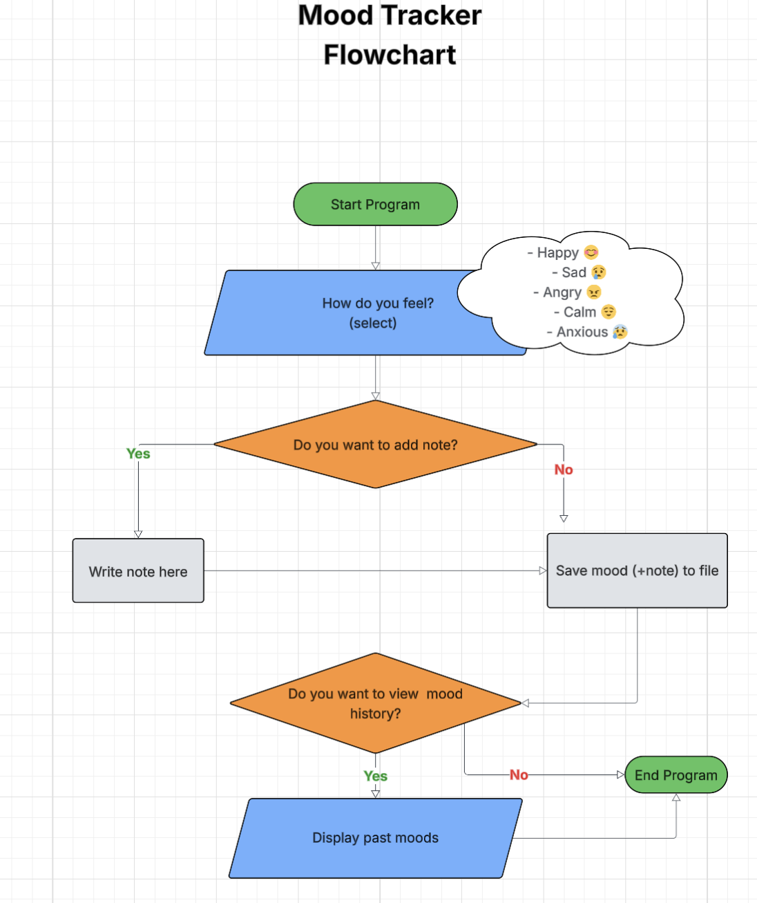

**MOOD TRACKER**

Simple Python Mood Logging Application

1. Description
2. Installation
3. Usage
4. Features
5. Error Handling
6. Deployment
7. Contributing
8. Flowchart

---

## 1. Description
Mood Tracker is a simple Python application that allows users to record their mood along with optional notes and timestamps. Users can view their mood history with color-coded output for easy tracking of emotional patterns.

## 2. Installation
1 - Make sure you have Python 3.6+ installed.
2 - Clone the repository:
    git clone https://github.com/yourusername/mood-tracker.git
3 - Navigate into the project directory:
    cd mood-tracker
4 - Install dependencies using pip:
    pip install -r requirements.txt
    ## Note: ## After cloning the repository, run pip install -r requirements.txt to install all necessary dependencies before running the program.

## 3. Usage
Run the program using:
    python run.py

Follow the prompts to:
    Enter your current mood (happy, sad, angry, calm, anxius)
    Optionally add a note
    View mood history
    Exit the program

Example:

How are you feeling? (happy, sad, angry, calm, anxius): happy
Would you like to add a note? (yes/no): yes
Enter your note: Feeling great today!
Logged mood 'happy' at 2025-08-10 15:20:00
Would you like to see the mood history data? (yes/no): yes
2025-08-10 15:20:00 - Mood: happy
Note: Feeling great today!
Would you like to exit the program? (yes/no): yes
Goodbye! Have a nice day!

## 4. Features
- Mood input validation with user-friendly prompts
- Optional note addition for detailed mood tracking
- Timestamped mood entries stored in a JSON file
- Color-coded mood history display
- Error handling for file operations and invalid inputs

## 5. Error Handling
- Handles missing or corrupted mood history files by creating/resetting them
- Validates all user inputs, prompting the user again on invalid responses
- Catches file write errors and informs the user
------------------------------------------------------------------------------------------
# Read mood history from file with error handling
try:
    with open(MOOD_FILE, 'r', encoding='utf-8') as file:
        data = json.load(file)
except FileNotFoundError:
    print(Fore.RED + "Mood history file not found. Creating a new one." + Style.RESET_ALL)
    data = {}
except json.JSONDecodeError:
    print(Fore.RED + "Mood history file is corrupted. Resetting data." + Style.RESET_ALL)
    data = {}

# Save mood data to file with error handling
try:
    with open(MOOD_FILE, 'w', encoding='utf-8') as file:
        json.dump(data, file, ensure_ascii=False, indent=4)
except OSError as e:
    print(Fore.RED + f"Error saving mood data: {e}" + Style.RESET_ALL)
------------------------------------------------------------------------------------------

## 6. Deployment
This project can be deployed easily on platforms like Heroku.
    Steps include:
    - Set up a Python environment
    - Push the project repository to Heroku
    - Use a requirements.txt file to manage dependencies
    - Configure Procfile if needed

## 7. Flowchart

The flowchart illustrates the user interaction flow of the Mood Tracker application:

1. Start Program: The program begins execution.
2. Mood Selection: The user is prompted to select their current mood from predefined options: Happy, Sad, Angry, Calm, or Anxious.
3. Add Note Decision: The user is asked whether they want to add a note related to their mood.
    - If Yes, the user writes a note.
    - If No, the program skips to saving the mood.
4. Save Mood: The mood (and note if provided) is saved to a file.
5. View Mood History Decision: The user is asked if they want to view their past mood entries.
    - If Yes, the program displays the mood history.
    - If No, the program ends.
6. End Program: The program terminates.

This flowchart provides a visual guide to the program's logic and user input handling.
If you would like to see the image of flowchart:

