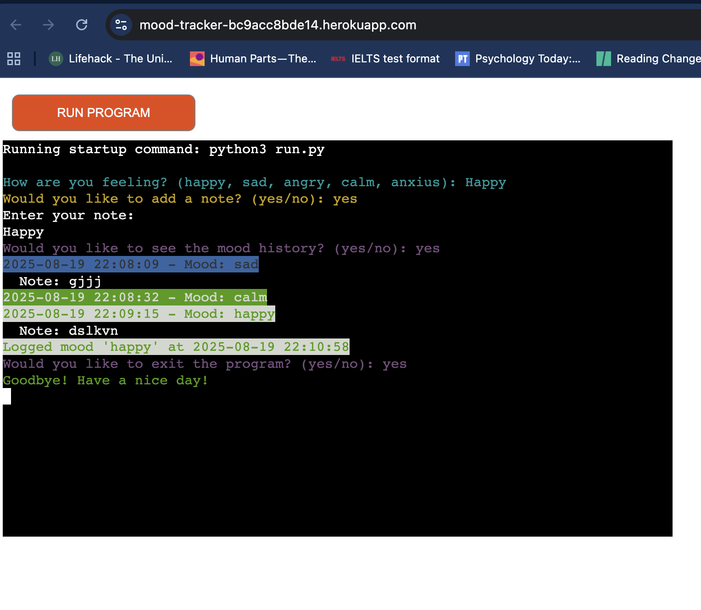
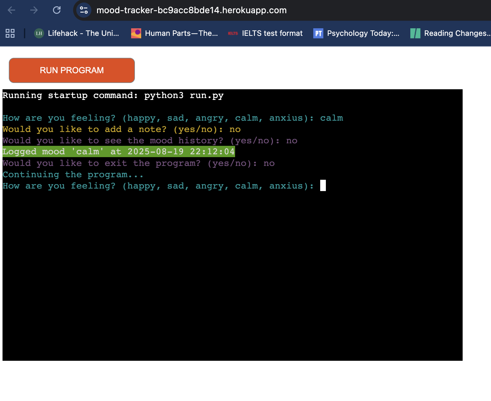
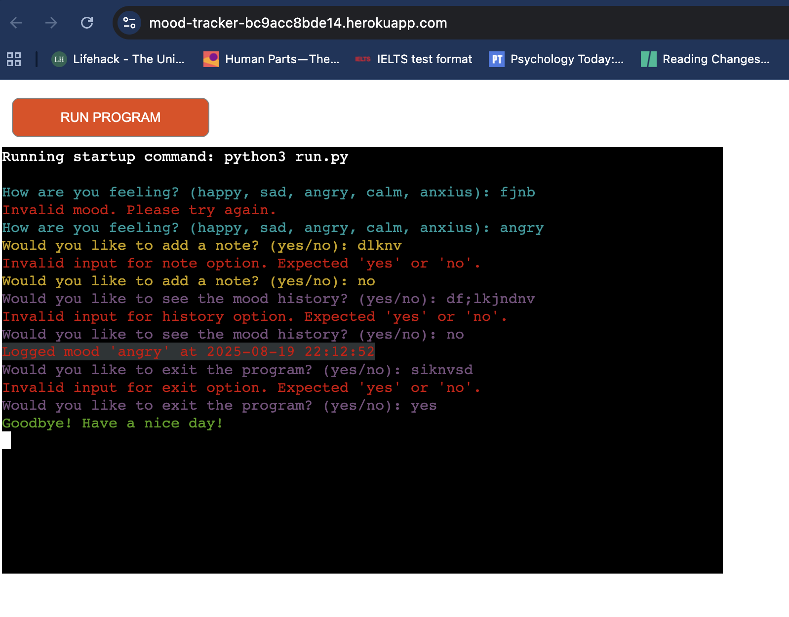
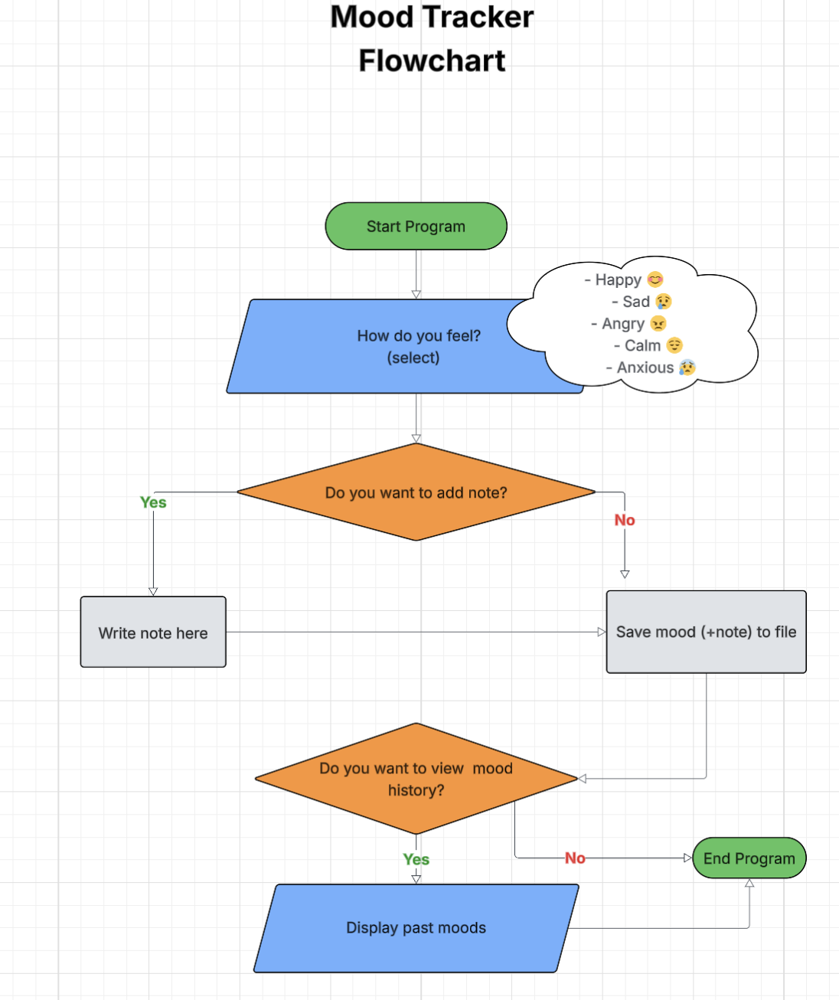

<div align="center">
  <h4> MOOD TRACKER </h4>
</div>


[Mood Tracker](https://mood-tracker-bc9acc8bde14.herokuapp.com/) is a simple yet powerful Python application designed to help users record and explore their emotions over time. Instead of just logging moods, it allows users to capture the subtle context of each feeling through optional notes and timestamps. The core feature is a color-coded interactive history, which makes it easy to visually track emotional patterns and identify trends.

The goal of Mood Tracker is not merely to store data, but to create awareness and insight into one’s emotional landscape, turning daily reflections into a meaningful habit. A minimal and clear interface has been maintained, presenting only the necessary prompts and outputs to keep the focus on the moods and notes.

By combining intuitive input validation, optional note-taking, and visual feedback through color-coded output, Mood Tracker offers a coherent, interactive experience that encourages mindful self-reflection, rather than just acting as a static log of feelings.

## Table of Contents
1. [Installation](#1-installation)
2. [Usage](#2-usage)
3. [Features](#3-features)
4. [Error Handling](#4-error-handling)
5. [Deployment](#5-deployment)
6. [Flowchart](#6-flowchart)
7. [Testing](#7-testing)
8. [Bug Fixes](£8-bug-fixes)
9. [Libraries](#9-libraries)
10. [Credits](#10-credits)

---

## 2. Installation

Follow these steps to set up Mood Tracker on your local machine:

1. Install Python 3.6+
    
    Make sure Python 3.6 or higher is installed on your system. You can check with:
    
        python3 --version

2. Clone the repository:

        git clone https://github.com/yourusername/mood-tracker.git

3. Navigate into the project directory:

        cd mood-tracker
    
4. Set up a virtual environment (optional but recommended)

        python3 -m venv venv
        source venv/bin/activate  # Mac/Linux
        venv\Scripts\activate     # Windows

5. Install dependencies using pip:

        pip install -r requirements.txt

6. Run the program:

        python3 run.py

---

## 3. Usage
Run the program using:

    python run.py

Follow the prompts to:

    Enter your current mood (happy, sad, angry, calm, anxius)

    Optionally add a note
    
    View mood history
    
    Exit the program





## 4. Features
- Mood input validation with user-friendly prompts
- Optional note addition for detailed mood tracking
- Timestamped mood entries stored in a JSON file
- Color-coded mood history display (Colorama Library)
- Error handling for file operations and invalid inputs

## 5. Error Handling
- Handles missing or corrupted mood history files by creating/resetting them
- Validates all user inputs, prompting the user again on invalid responses
- Catches file write errors and informs the user
------------------------------------------------------------------------------------------
#### Read mood history from file with error handling

```python
 try:
        with open(MOOD_FILE, 'r', encoding='utf-8') as file:
            data = json.load(file)
    except (FileNotFoundError, json.JSONDecodeError):
        data = {}
    return data
```

#### Save mood data to file with error handling
```python
 try:
            show = input(
                Fore.MAGENTA + "Would you like to see the mood history? "
                "(yes/no): "
                ).strip().lower()
            if show == "yes":
                show_history(data)
                break
            elif show == "no":
                return ""
            else:
                raise ValueError(
                    "Invalid input for history option. Expected "
                    "'yes' or 'no'.")
        except ValueError as e:
            print(Fore.RED + str(e) + Style.RESET_ALL)
```


## 6. Deployment
This project can be deployed easily on platforms like Heroku.

    Steps include:

    - Set up a Python environment

    - Push the project repository to Heroku

    - Use a requirements.txt file to manage dependencies

    - Configure Procfile if needed

## 7. Flowchart

The flowchart illustrates the user interaction flow of the Mood Tracker application:

1. **Start Program:** The program begins execution.
2. **Mood Selection:** The user is prompted to select their current mood from predefined options: Happy, Sad, Angry, Calm, or Anxious.
3. **Add Note Decision:** The user is asked whether they want to add a note related to their mood.
    - If Yes, the user writes a note.
    - If No, the program skips to saving the mood.
4. **Save Mood:** The mood (and note if provided) is saved to a file.
5. **View Mood History Decision:** The user is asked if they want to view their past mood entries.
    - If Yes, the program displays the mood history.
    - If No, the program ends.
6. **End Program:** The program terminates. 
    - If Yes, the program continues and asks moods again.
    - If No, the program ends.

This flowchart provides a visual guide to the program's logic and user input handling.

If you would like to see the image of flowchart:


## 8. Testing

I have manually tested this project by doing the following:

- Passed the code through a PEP8 linter and confirmed there are no problems
- Tested in my local terminal and on my Heroku terminal

**Validator Testing**
- PEP8 
    No errors were returned from PEP8online.com